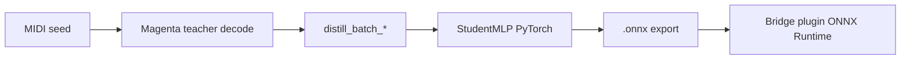
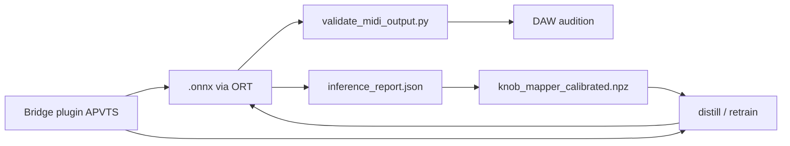
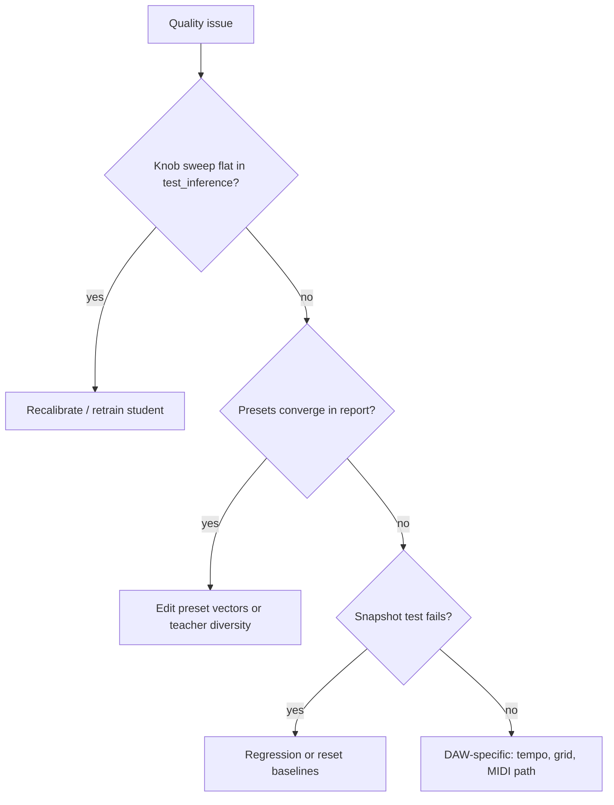

# Bridge ML models

This directory holds **optional** machine-learning models that enhance humanization and generation. The plugin builds and runs without any of these files; when models are missing, legacy algorithms are used.

## Layout

- **`training/`** — Python + Colab notebooks. Train **student** MLPs here; Magenta/TensorFlow are **training-time only** (never linked from C++).
- **`models/`** — Place trained **`.onnx`** files here **before** building the plugin if you want them embedded via JUCE `BinaryData`. Expected names (when present):
  - `drum_humanizer.onnx`
  - `bass_model.onnx`
  - `chords_model.onnx`
  - `melody_model.onnx`
  - `guitar_strum.onnx`
  - `guitar_inertia.onnx`

Bundled **seed MIDI** for notebooks without external data: `training/test_fixtures/simple_groove.mid` (regenerate with `training/test_fixtures/build_simple_groove.py`).

## Python dependencies (Colab / training)

Prefer the pinned set in `training/requirements.txt` (TensorFlow 2.14–2.16, `magenta`, `note-seq`, PyTorch, ONNX, etc.).

```bash
pip install -r ml/training/requirements.txt
```

## Training with real Magenta teachers

Student networks match **fixed Bridge ONNX layouts** (e.g. drums 46→32, bass 93→64). **Teachers** are full Magenta **MusicVAE / GrooVAE** checkpoints; training **distills** their decoded `NoteSequence` outputs into the small MLPs.

### Checkpoints (download URLs)

| Instrument | Magenta `CONFIG_MAP` key | Checkpoint `.tar` (Google Cloud Storage) |
|------------|--------------------------|-------------------------------------------|
| **Drums** | `groovae_4bar` | `https://storage.googleapis.com/magentadata/models/music_vae/checkpoints/groovae_4bar.tar` |
| **Bass** | `cat-mel_2bar_big` | `https://storage.googleapis.com/magentadata/models/music_vae/checkpoints/cat-mel_2bar_big.tar` |
| **Chords** | `cat-mel_2bar_med_chords` | `https://storage.googleapis.com/magentadata/models/music_vae/checkpoints/cat-mel_2bar_med_chords.tar` |
| **Melody** | `cat-mel_2bar_small` | `https://storage.googleapis.com/magentadata/models/music_vae/checkpoints/cat-mel_2bar_small.tar` |

**Note:** The browser/JS checkpoint **mel_4bar_small_q2** is in the same MusicVAE family; the Python notebook uses **`cat-mel_2bar_small`** for a faster, well-supported 2-bar mel checkpoint on Colab.

Teachers download and extract under `CACHE_DIR` (default `/content/magenta_ckpt` in notebooks). If download or `TrainedModel` load fails, teachers **warn** and fall back to structured random / synthetic targets so notebooks still complete.

### Expected runtime (Colab free tier, T4, defaults)

Rough order-of-magnitude with **`n_samples = 500`** and **`TRAIN_STEPS = 1200`** per notebook:

- Checkpoint download + extract (first run only): **~2–5 min** per model (network dependent).
- `distill_batch_*`: **~3–8 min** (TensorFlow decode per sample).
- PyTorch student training: **~2–4 min**.

Total per instrument often **~8–14 minutes** first run; reruns with cached checkpoints skew shorter. Raise **`n_samples`** / **`TRAIN_STEPS`** for better quality (slower).

### Using your own MIDI as seed

1. Upload a `.mid` to Colab (or add to the repo).
2. Set `USER_MIDI = "/content/your_file.mid"` in the notebook (see cell **“Dataset size & cache”**).
3. `magenta_data_utils.load_midi_to_note_sequence` + helpers derive prior grids, groove scalars, bass/chord/melody context from that sequence.

Drum/chord/melody distillation still pairs those contexts with **random** personality knobs and (where applicable) random bass/kick slices so the student sees diverse **(input, target)** pairs.

### Distillation flow



Shared **`knob_mapping.KnobToLatentMapper`** maps the same 10 APVTS personality knobs to a **512-D** offset; each teacher projects that to its checkpoint **z_size** before `decode`.

### Notebooks

| Notebook | Output |
|----------|--------|
| `training/train_drums.ipynb` | `drum_humanizer.onnx` |
| `training/train_bass.ipynb` | `bass_model.onnx` |
| `training/train_chords.ipynb` | `chords_model.onnx` |
| `training/train_melody.ipynb` | `melody_model.onnx` |

Run all cells top-to-bottom: install → set `n_samples` / `TRAIN_STEPS` → (optional) `USER_MIDI` → distill → `train_student_from_xy` → export → ONNX Runtime shape assert → `files.download` on Colab.

## How to train (quick reference)

1. Open the matching **`train_*.ipynb`** in Colab (Python 3.10 + GPU recommended).
2. Clone or upload the Bridge repo so `REPO = "/content/Bridge"` resolves.
3. Run all cells; copy downloaded `.onnx` files into `ml/models/` and rebuild the plugin.

## Validation & tuning (no Magenta / TensorFlow)

Use a small venv with **`onnxruntime`**, **`numpy`**, **`pretty_midi`**, and optionally **`note-seq`** (only if you use helpers that load legacy `NoteSequence` fixtures). Training-only packages are not required.

### `test_inference.py` — knob sensitivity & dead outputs

Runs a **50-sample Latin hypercube** over the 10 personality knobs (fixed deterministic non-knob context per instrument), measures mean **binary entropy** of sigmoid-like outputs, **L2 finite-difference sensitivity** per knob, and **dead output** indices (never above 0.1 across the run).

```bash
pip install onnxruntime numpy
python ml/training/test_inference.py --models-dir ml/models --out ml/models/inference_report.json
```

**`inference_report.json`** contains `sensitivity_l2_mean` per instrument (length 10, same knob order as the plugin). Use it to see which APVTS dimensions actually move each student’s logits.

### `knob_calibration.py` — rescale `KnobToLatentMapper`

After an inference report exists:

```bash
python ml/training/knob_calibration.py --report ml/models/inference_report.json --out ml/models/knob_mapper_calibrated.npz
```

Pass `--out` / `mapper_path` into **`distill_batch_*(..., mapper_path=...)`** in `magenta_pipeline.py` so teachers use the calibrated latent axes when generating distillation targets. Re-export `.onnx` and copy into `ml/models/` as usual.

### `validate_midi_output.py` — audition one knob vector

```bash
pip install pretty_midi
python ml/training/validate_midi_output.py \
  --model ml/models/drum_humanizer.onnx \
  --instrument drums \
  --knobs 0.8,0.2,0.5,0.5,0.3,0.7,0.5,0.5,0.5,0.5 \
  --out /tmp/test_output.mid
```

Optional: `--root`, `--octave`, `--chord-octave`, `--melody-octave`, `--bpm`. Output mapping mirrors the plugin’s merge logic at a high level (drums → GM lanes; bass/chords/melody → pitched notes).

### `snapshot_tests.py` — lightweight ONNX regression

```bash
# One-time baselines at [0.5]^10 (requires all four .onnx files in ml/models/)
python ml/training/snapshot_tests.py init-baselines --models-dir ml/models

# Re-run inference and compare cosine similarity (default ≥ 0.95)
python ml/training/snapshot_tests.py run --models-dir ml/models
```

With **no** JSON files under `ml/models/snapshots/`, `run` exits successfully (CI-friendly). From the build tree: `cmake --build build --target test-ml` (or your generator’s equivalent). If `onnxruntime` is not installed for the detected Python, `test-ml` still succeeds and prints a skip message.

### Named personality presets (plugin + Python)

- Knob vectors: `ml/training/personality_presets.py`
- Same values for the Settings UI: `Source/PersonalityPresets.h`

When adding a preset, update **both** files, bump display strings if needed, and keep the **APVTS** choice order: `Custom`, then entries in `kPresets` order.

### Round trip



## Iteration workflow (quality & versioning)

Use **`pandas`**, **`pretty_midi`**, and **`onnxruntime`** for metrics and reports; **Magenta / TensorFlow** only when running `retrain_pipeline.py` distillation.

### When to retrain vs recalibrate vs tweak presets

| Situation | Likely fix |
|-----------|------------|
| Knobs have low sensitivity (`inference_report.json`) or many dead outputs | **Recalibrate** (`knob_calibration.py`) then re-distill with `mapper_path`, or **retrain** with more `n_samples` |
| Presets sound the same (`preset_quality_report.md` convergence warnings) | **Adjust preset vectors** in `personality_presets.py` / `PersonalityPresets.h`, or improve training diversity; check **pitch entropy** and **density** in `quality_metrics` |
| ONNX outputs drift unexpectedly | Run **`snapshot_tests.py run`**; if models changed on purpose, **`init-baselines`** |
| Good metrics in Colab but poor in DAW | Validate with **`validate_midi_output.py`** and real host tempo; regenerate **`preset_quality_report.md`** |

### `quality_metrics.py`

Programmatic proxies: IOI variance (rhythmic consistency), pitch entropy, velocity range, note density, groove ratio (strong vs weak sixteenths), melodic contour smoothness (pitched instruments).

```bash
pip install numpy pretty_midi pandas onnxruntime
python -c "from quality_metrics import score_midi_file; print(score_midi_file('out.mid','drums'))"
```

### `model_registry.py` — versioned `ml/models/<tag>/`

- **`register`** — snapshot current flat `ml/models` artifacts into `ml/models/<VERSION>/` and append **`registry.json`**.
- **`activate`** — copy a tagged folder to **`ml/models/current/`** and overwrite top-level `.onnx` / reports so the **existing** plugin layout keeps working.
- **`list`** / **`compare`** — inspect versions and diff `quality_scores.json` / `inference_report.json`.

```bash
python ml/training/model_registry.py register v2 --source ml/models --root ml/models
python ml/training/model_registry.py activate v2 --root ml/models
python ml/training/model_registry.py compare v1 v2 --root ml/models
```

**CMake:** `cmake -DML_REGISTER_VERSION=v2 --build build --target ml-register`  
**Make:** `make ml-register VERSION=v2`

### `generate_preset_report.py`

Builds **`ml/models/preset_quality_report.md`**: sweep all presets × four instruments, ASCII heatmaps, convergence warnings (~5%), dead-knob callouts, short tuning hints.

```bash
python ml/training/generate_preset_report.py --models-dir ml/models
```

### `retrain_pipeline.py`

Full loop (host Python env with **Magenta + PyTorch**): distill → train → export → `test_inference` → snapshot test → validation MIDIs → `quality_scores.json` → optional **`register`**.

```bash
python ml/training/retrain_pipeline.py --instrument drums --n-samples 1000 --train-steps 1200 \
  --calibrate --version-tag v2 --midi-seed path/to/seed.mid
# all four:
python ml/training/retrain_pipeline.py --instrument all --n-samples 500 --version-tag v3
```

Use **`--skip-snapshot-test`** only if you will refresh baselines separately. If snapshot fails after an intentional architecture change, run **`snapshot_tests.py init-baselines`**.

### Interpreting `preset_quality_report.md`

- **Heatmap**: each column is normalized to that instrument’s max — use it to see which presets stand out, not absolute loudness.
- **Convergence warnings**: two presets map to similar MIDI statistics → users may not hear a difference; separate knob directions that have **high sensitivity** in `inference_report.json`.
- **Dead knobs**: consider calibration or more training data stressing those dimensions.

### Decision tree (quality issue → cause → fix)


